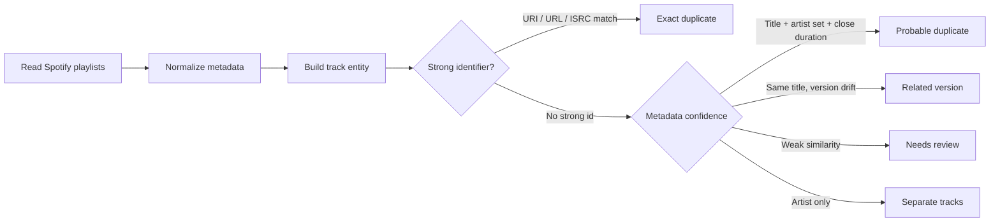
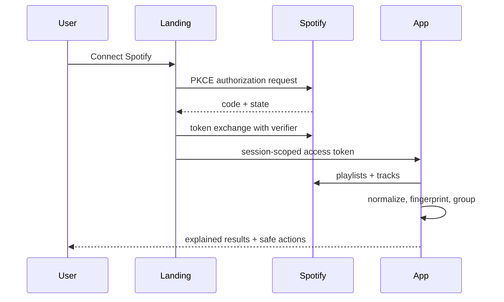

<p align="center">
  
</p>

<h1 align="center">WashList</h1>

<p align="center">
  <b>Spotify library intelligence that finds real duplicates without hiding valid versions.</b>
</p>

<p align="center">
  <a href="https://stonerhand.github.io/WashList/"></a>
  
  
  
</p>

<p align="center">
  <a href="https://stonerhand.github.io/WashList/"><b>Open WashList</b></a>
  ·
  <a href="#product-logic">Product logic</a>
  ·
  <a href="#screens">Screens</a>
  ·
  <a href="#quality-gates">Quality gates</a>
  ·
  <a href="./docs/security.md">Security notes</a>
  ·
  <a href="./docs/i18n.md">i18n guide</a>
</p>

---

## Why WashList exists

Spotify libraries get messy in a quiet way: the same song appears from a single, an album, a deluxe edition, a remaster, a live session, a remix, or a random playlist import. Most cleaners either miss those relationships or over-delete by treating weak signals as truth.

WashList is built around a safer principle:

> A duplicate is a decision with evidence, not just a matching artist name.

It scans playlists, builds normalized track fingerprints, explains why items are grouped, and keeps uncertain results visible for review.

## Screens

| Landing | App shell |
| --- | --- |
|  |  |

## Product Logic



### Dedup rules

| Signal | Result | Auto-remove |
| --- | --- | --- |
| Same Spotify URI / URL / ISRC | Exact duplicate | Allowed after user action |
| Same normalized title + same artist set + close duration | Probable duplicate | No, review first |
| Same title but remix/live/acoustic/sped/slowed/remaster difference | Related version | No |
| Same artist only | Separate tracks | Never |
| Similar title only | Review | Never |

<details>
<summary><b>What counts as a track entity?</b></summary>

WashList separates the model into track-level signals:

- `Track`: title, URI, Spotify id, duration, external URL.
- `Artist set`: normalized artist names and ids.
- `Album`: album title, album id, artwork.
- `Version tags`: remaster, live, acoustic, remix, sped up, slowed, instrumental.
- `Source`: Spotify playlist or liked songs.
- `Evidence`: reason key, confidence score, actionability.

This prevents the classic false positive: different songs by the same artist being merged together.
</details>

## Features

| Area | What it does |
| --- | --- |
| Library scan | Loads Spotify playlists and liked songs with API backoff. |
| Smart matching | Groups exact duplicates, probable duplicates, related versions, and review items separately. |
| Safe cleanup | Supports dry-run, per-track removal, group removal, and local cleanup history. |
| Explainability | Every duplicate group shows the reason and confidence. |
| Comparison | Compares two playlists and highlights shared tracks. |
| Overlap map | Finds tracks living in several playlists at once. |
| Graph view | Visualizes playlist relationships. |
| Localization | English, Russian, German, Spanish, French with fallback behavior. |
| Privacy | No backend, no analytics, no tracking. Spotify token is session-scoped. |

## Architecture

```text
index.html                         Landing page and product preview
app.html                           App shell
js/landing-auth.js                 Spotify PKCE OAuth callback and auth handoff
js/washlist-app.js                 App state, Spotify API, scan/dedup/render logic
js/waveform-bg.js                  Canvas waveform background
styles/tokens.css                  Shared design tokens and theme variables
styles/app.css                     Core app components
styles/live.css                    Data-connected states and responsive layer
styles/landing-transition.css      Landing-to-app transition styles
docs/i18n.md                       Localization workflow and glossary
docs/security.md                   Security report and production hardening notes
tools/qa-check.mjs                 Static regression checks
```

<details>
<summary><b>Data flow</b></summary>


</details>

## Security Posture

Implemented frontend hardening:

- Spotify PKCE OAuth.
- No `user-read-email` scope.
- Session-scoped access token with legacy localStorage cleanup.
- Sanitized HTML i18n strings.
- Escaped user/API data before HTML rendering.
- Basic static CSP and referrer policy metadata.
- App page marked `noindex,nofollow`.
- Double-click guard for duplicate removal.

Production notes live in [docs/security.md](./docs/security.md).

## Localization

WashList currently ships:

| Locale | Status |
| --- | --- |
| English | Source / fallback |
| Russian | Product UI copy |
| German | Product UI copy |
| Spanish | Product UI copy |
| French | Product UI copy |

The localization workflow, glossary, QA checklist, and recommended Crowdin/Lokalise/Phrase process live in [docs/i18n.md](./docs/i18n.md).

## Local Development

```bash
python3 -m http.server 4173
```

Open:

- `http://127.0.0.1:4173/index.html`
- `http://127.0.0.1:4173/app.html`
- `http://127.0.0.1:4173/app.html#settings`

## Spotify Setup

1. Create an app in the [Spotify Developer Dashboard](https://developer.spotify.com/dashboard).
2. Add redirect URI: `https://stonerhand.github.io/WashList/`.
3. Keep the public client id in [js/landing-auth.js](./js/landing-auth.js).
4. Open the site and click **Connect Spotify**.

## Quality Gates

Run static checks:

```bash
node tools/qa-check.mjs
node --check js/landing-auth.js
node --check js/washlist-app.js
python3 -m html.parser index.html
python3 -m html.parser app.html
```

Manual smoke checklist:

- Landing opens without console errors.
- Language switcher updates the product preview and marquee.
- App without auth shows a connect state, not demo data.
- `#library`, `#duplicates`, `#compare`, `#overlap`, `#graph`, `#history`, `#settings` deep links select the right section.
- Search is debounced and does not visibly lag.
- Duplicate removal disables repeat clicks and removes confirmed tracks from local results.
- Logout clears session-scoped Spotify credentials.
- Mobile viewport has no horizontal overflow.

## Roadmap

- Move Spotify OAuth/token refresh to a backend for HttpOnly cookies.
- Extract deduplication into a standalone tested module.
- Add fixture-based unit tests for matching edge cases.
- Add Playwright e2e for language/theme/navigation regressions.
- Add edge-level HTTP security headers on Cloudflare/Vercel/Netlify.

## Limits

- GitHub Pages cannot set the full HTTP security header set. Meta CSP is useful, but edge headers are better.
- A backend-free Spotify app cannot use HttpOnly token cookies.
- The current app is optimized for a static deployment. A larger product should split services, repositories, and tests into modules.

## Author

Made by [StonerHand](https://github.com/StonerHand).
