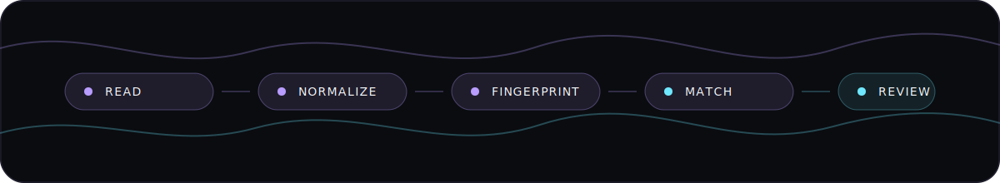
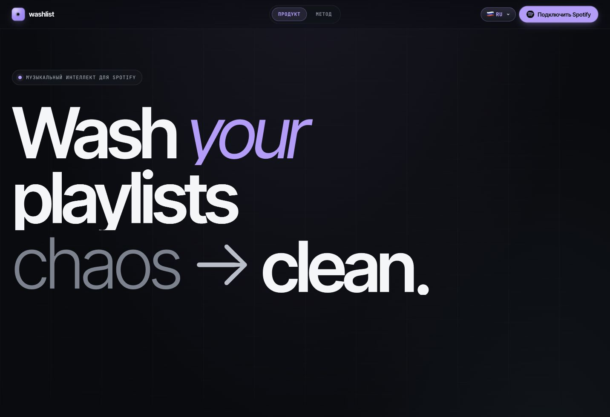
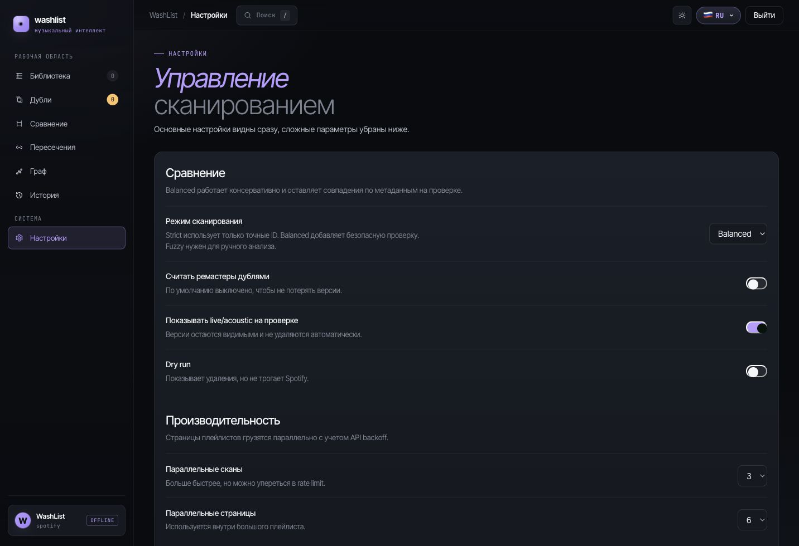
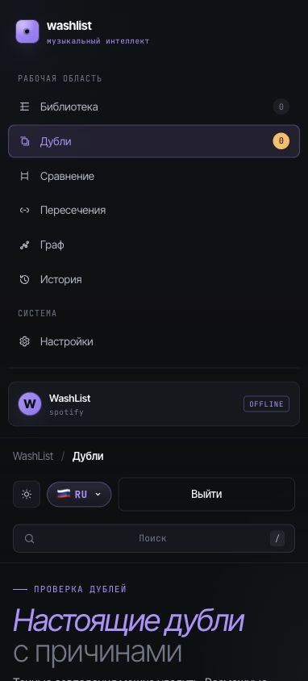
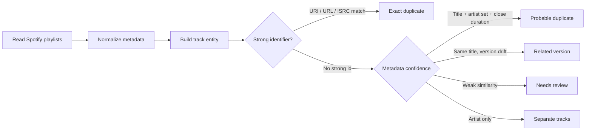
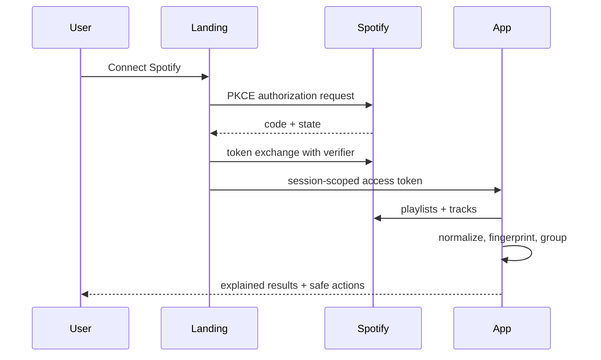

<p align="center">
  
</p>

<h1 align="center">WashList</h1>

<p align="center">
  <b>Spotify library intelligence that finds real duplicates without hiding valid versions.</b>
</p>

<p align="center">
  <a href="https://stonerhand.github.io/WashList/"></a>
  
  
  
</p>

<p align="center">
  <a href="https://stonerhand.github.io/WashList/"><b>Open WashList</b></a>
  ·
  <a href="#product-logic">Product logic</a>
  ·
  <a href="#screens">Screens</a>
  ·
  <a href="#quality-gates">Quality gates</a>
  ·
  <a href="./docs/security.md">Security notes</a>
  ·
  <a href="./docs/i18n.md">i18n guide</a>
</p>

---

## Why WashList exists

Spotify libraries get messy in a quiet way: the same song appears from a single, an album, a deluxe edition, a remaster, a live session, a remix, or a random playlist import. Most cleaners either miss those relationships or over-delete by treating weak signals as truth.

WashList is built around a safer principle:

> A duplicate is a decision with evidence, not just a matching artist name.

It scans playlists, builds normalized track fingerprints, explains why items are grouped, and keeps uncertain results visible for review.

## Experience Principles

| Principle | Product behavior |
| --- | --- |
| Fast path first | Connect, scan, review, remove. No demo mode, no dead-end screens, no hidden commands. |
| Evidence over guesses | Every duplicate group exposes the matching reason, confidence, source, duration, and artwork. |
| Safe by default | Versions and weak matches stay visible. Destructive actions require explicit user intent. |
| State clarity | Signed out, connected, loading, failed, empty, and removed states all have distinct UI and copy. |
| Static and private | Runs on GitHub Pages, uses Spotify PKCE, stores tokens in the browser session, and sends no analytics. |

## Latest Hardening Pass

- App-level Spotify connect now starts OAuth directly, so signed-out users are not bounced through the landing page.
- Logout clears token, verifier, OAuth state, playlist cache, load errors, and flips the top action back to **Connect Spotify**.
- Spotify DELETE edge cases are handled: empty success bodies are valid, stale permissions get a clear reconnect message, and non-editable playlists explain the limitation.
- The signed-out connect gate was restyled to feel like the product surface, not an error box.
- App language choices now match complete app dictionaries, while the landing keeps broader marketing-localized copy.
- QA now guards auth route behavior, top-button state, empty DELETE responses, duplicate removal safety, cache busting, and stale transition code.

## Screens

| Landing | App auth + compare | Mobile compare |
| --- | --- | --- |
|  |  |  |

Screens intentionally include the signed-out app state: users should always see a useful Spotify connection path instead of an empty or broken workspace.

## Current Status

| Area | Status |
| --- | --- |
| Spotify auth | `index.html?connect=1` and `app.html?connect=1` start PKCE with the canonical directory redirect URL. The app no longer flashes the landing page before Spotify. |
| Signed-out UX | Internal app routes show a polished Spotify connect gate and the top action switches back to **Connect Spotify** after logout. |
| Connected error UX | If Spotify profile loads but playlists fail, WashList keeps the user signed in and shows retry/sign-out actions instead of a fake connect prompt. |
| Compare view | Playlist comparison renders album artwork, track title, artist, duration, and shared-match state. |
| Duplicate safety | Metadata groups require close duration or explicit version evidence. Artist-only matches are never duplicates. |
| Duplicate removal | Empty Spotify DELETE responses are treated as success, per-track buttons recover after errors, and playlist removal avoids extra pre-delete API reads. |
| Static deployment | CSS/JS references include cache-busting query strings so GitHub Pages serves the current app after deploy. |
| Motion | Heavy cross-page blur/overlay transitions were removed; only local microinteractions remain. |
| Regression checks | `tools/qa-check.mjs` covers direct app OAuth, canonical OAuth redirect, auth button state, connected load failures, auth-gate UI, duplicate removal, compare artwork, cache busting, token storage, and duplicate guards. |

## Product Tour

<details open>
<summary><b>1. Connect</b> · Spotify PKCE without a backend</summary>

The landing page keeps the product promise focused: connect Spotify, scan playlists, review duplicates. Direct app entry shows a connect gate, `?connect=1` starts the Spotify flow, and valid existing sessions go straight to the workspace instead of opening Spotify again.
</details>

<details open>
<summary><b>2. Scan</b> · Fast playlist loading with visible progress</summary>

Playlist pages are loaded with controlled parallelism, API backoff, timeout handling, debounced search, and local progress states. The UI stays responsive while scan results are built.
</details>

<details open>
<summary><b>3. Review</b> · Evidence-first duplicate decisions</summary>

Every group shows why it exists: exact URI/ISRC, metadata confidence, related version, or review-needed. Artist-only matches are never treated as duplicates.
</details>

<details>
<summary><b>4. Clean up</b> · Per-track and group-level actions</summary>

Users can remove one duplicate track or resolve a full group. Repeat clicks are guarded, removed tracks disappear from local results, and dry-run mode keeps Spotify untouched.
</details>

## Product Logic



### Dedup rules

| Signal | Result | Auto-remove |
| --- | --- | --- |
| Same Spotify URI / URL / ISRC | Exact duplicate | Allowed after user action |
| Same normalized title + same artist set + close duration | Probable duplicate | No, review first |
| Same title but remix/live/acoustic/sped/slowed/remaster difference | Related version | No |
| Same artist only | Separate tracks | Never |
| Similar title only | Review | Never |

<details>
<summary><b>What counts as a track entity?</b></summary>

WashList separates the model into track-level signals:

- `Track`: title, URI, Spotify id, duration, external URL.
- `Artist set`: normalized artist names and ids.
- `Album`: album title, album id, artwork.
- `Version tags`: remaster, live, acoustic, remix, sped up, slowed, instrumental.
- `Source`: Spotify playlist or liked songs.
- `Evidence`: reason key, confidence score, actionability.

This prevents the classic false positive: different songs by the same artist being merged together.
</details>

## Features

| Area | What it does |
| --- | --- |
| Library scan | Loads Spotify playlists and liked songs with API backoff. |
| Smart matching | Groups exact duplicates, probable duplicates, related versions, and review items separately. |
| Safe cleanup | Supports dry-run, per-track removal, group removal, and local cleanup history. |
| Explainability | Every duplicate group shows the reason and confidence. |
| Comparison | Compares two playlists with album artwork and highlights shared tracks. |
| Overlap map | Finds tracks living in several playlists at once. |
| Graph view | Visualizes playlist relationships. |
| Localization | English, Russian, German, Spanish, French with fallback behavior. |
| Privacy | No backend, no analytics, no tracking. Spotify token is session-scoped. |

## Architecture

```text
index.html                         Landing page and product preview
app.html                           App shell
js/landing-auth.js                 Spotify PKCE OAuth callback and auth handoff
js/washlist-app.js                 App state, Spotify API, scan/dedup/render logic
js/waveform-bg.js                  Canvas waveform background
styles/tokens.css                  Shared design tokens and theme variables
styles/app.css                     Core app components
styles/live.css                    Data-connected states and responsive layer
docs/i18n.md                       Localization workflow and glossary
docs/security.md                   Security report and production hardening notes
tools/qa-check.mjs                 Static regression checks
```

## Route Map

| Route | Purpose | Notes |
| --- | --- | --- |
| `index.html` | Public landing | Localized hero, product/method sections, Spotify connect. |
| `app.html#library` | Library scanner | Playlist scan, progress, filters, result summary. |
| `app.html#duplicates` | Duplicate review | Exact/probable/version/review queues with explanations. |
| `app.html#compare` | Playlist comparison | Shared tracks between selected playlists. |
| `app.html#overlap` | Multi-playlist overlap | Tracks appearing in three or more playlists. |
| `app.html#graph` | Relationship graph | Visual playlist connection map. |
| `app.html#history` | Cleanup history | Local action log and export path. |
| `app.html#settings` | Preferences | Scan mode, review rules, theme, language, performance limits. |

<details>
<summary><b>Data flow</b></summary>


</details>

## Security Posture

Implemented frontend hardening:

- Spotify PKCE OAuth.
- No `user-read-email` scope.
- Session-scoped access token with legacy localStorage cleanup.
- Sanitized HTML i18n strings.
- Escaped user/API data before HTML rendering.
- Basic static CSP and referrer policy metadata.
- App page marked `noindex,nofollow`.
- Double-click guard for duplicate removal.

Production notes live in [docs/security.md](./docs/security.md).

## Localization

WashList currently ships:

| Locale | Status |
| --- | --- |
| English | Source / fallback |
| Russian | Product UI copy |
| German | Landing copy |
| Spanish | Landing copy |
| French | Landing copy |

The localization workflow, glossary, QA checklist, and recommended Crowdin/Lokalise/Phrase process live in [docs/i18n.md](./docs/i18n.md).

## Local Development

```bash
python3 -m http.server 4173
```

Open:

- `http://127.0.0.1:4173/index.html`
- `http://127.0.0.1:4173/app.html`
- `http://127.0.0.1:4173/app.html#settings`

## Spotify Setup

1. Create an app in the [Spotify Developer Dashboard](https://developer.spotify.com/dashboard).
2. Add redirect URI: `https://stonerhand.github.io/WashList/`.
3. For local OAuth testing, also add `http://127.0.0.1:4173/`.
4. Keep the public client id in [js/landing-auth.js](./js/landing-auth.js).
5. Open the site and click **Connect Spotify**.

The Spotify client id is public by design for PKCE. Do not add a Spotify client secret to this static frontend.

## Quality Gates

Run static checks:

```bash
node tools/qa-check.mjs
node --check js/landing-auth.js
node --check js/washlist-app.js
python3 -m html.parser index.html
python3 -m html.parser app.html
```

Manual smoke checklist:

- Landing opens without console errors.
- Language switcher updates the product preview and marquee.
- App without auth shows a localized Spotify connect gate, not demo data.
- `app.html?connect=1` starts the PKCE flow directly without showing the landing page first.
- After logout the sidebar becomes offline and the top action becomes **Connect Spotify**.
- Spotify authorize URL uses the canonical directory redirect URI, not `/index.html`.
- If `/v1/me` works but playlist loading fails, the app keeps the user visible and shows retry/sign-out actions.
- Duplicate deletion treats empty Spotify success responses as success and shows permission-specific errors for stale scopes or non-editable playlists.
- `#library`, `#duplicates`, `#compare`, `#overlap`, `#graph`, `#history`, `#settings` deep links select the right section.
- Compare rows show album artwork and do not collapse to text-only lists.
- Search is debounced and does not visibly lag.
- Metadata-only duplicate groups require close duration or explicit version evidence.
- Duplicate removal disables repeat clicks and removes confirmed tracks from local results.
- Logout clears session-scoped Spotify credentials.
- Mobile viewport has no horizontal overflow.

<details>
<summary><b>Manual QA tour</b></summary>

1. Open the landing page and switch language.
2. Confirm Product and Method sections scroll to the right anchors.
3. Start Spotify auth and use browser Back without freezing the page.
4. Open each app route by hash and from the sidebar.
5. Scan with empty data, small data, and a large playlist.
6. Remove one duplicate track and confirm it disappears from the group.
7. Toggle strict/balanced/fuzzy scan rules and confirm labels remain understandable.
8. Switch light/dark theme and verify contrast, focus rings, and hover states.
9. Resize to mobile and confirm navigation, filters, settings, and duplicate cards remain usable.
</details>

## Roadmap

- Move Spotify OAuth/token refresh to a backend for HttpOnly cookies.
- Extract deduplication into a standalone tested module.
- Add fixture-based unit tests for matching edge cases.
- Add Playwright e2e for language/theme/navigation regressions.
- Add edge-level HTTP security headers on Cloudflare/Vercel/Netlify.

## Limits

- GitHub Pages cannot set the full HTTP security header set. Meta CSP is useful, but edge headers are better.
- A backend-free Spotify app cannot use HttpOnly token cookies.
- The current app is optimized for a static deployment. A larger product should split services, repositories, and tests into modules.

## Author

Made by [StonerHand](https://github.com/StonerHand).
